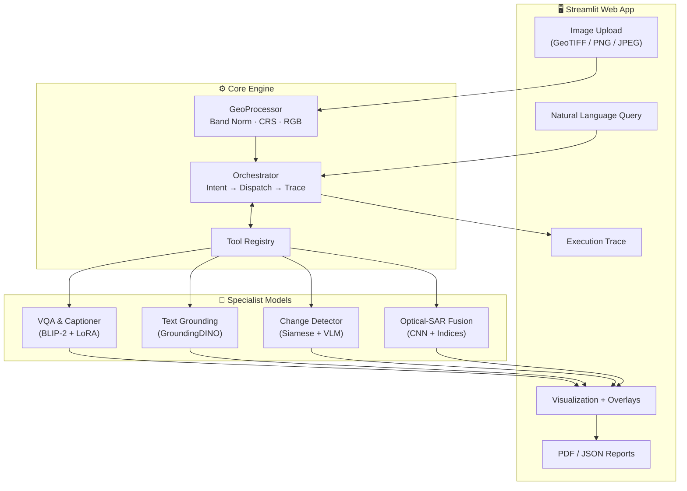

<p align="center">
  <h1 align="center">🛰️ SatQuery AI</h1>
  <p align="center">
    <strong>Agentic Multimodal Remote-Sensing Assistant</strong>
  </p>
  <p align="center">
    Query-driven vision-language AI for analyzing single, cross-modal (Optical + SAR),<br/>
    and bi-temporal remote-sensing images through natural language.
  </p>
</p>

---

## ✨ Key Capabilities

| Capability | Description | Models/Methods |
|:---|:---|:---|
| 🔍 **Visual Question Answering** | Answer natural-language questions about RS imagery | BLIP-2 + LoRA |
| 📝 **Image Captioning** | Generate detailed scene descriptions | BLIP-2 |
| 📍 **Region Grounding** | Locate objects/regions from text queries → bounding boxes | GroundingDINO |
| 🔄 **Change Detection** | Bi-temporal change maps + change-VQA + captioning | Siamese ResNet-18 + VLM |
| 🌐 **Optical-SAR Fusion** | Joint spectral/backscatter classification (water/flood/built-up) | CNN + NDVI/NDWI + VV/VH |
| 🤖 **Agentic Orchestrator** | Intent classification → tool routing → auditable trace | Rule-based + registry |

---

## 🏗️ Architecture



---

## 📁 Repository Structure

```
satquery-ai/
├── README.md                          # This file
├── requirements.txt                   # Python dependencies
├── setup.py                           # Package installation
├── config/
│   └── settings.yaml                  # Central configuration
├── data/
│   ├── sample_data/                   # Synthetic sample images
│   │   └── generate_samples.py        # Sample data generator
│   └── download_benchmarks.py         # BigEarthNet, RSVQA, VRSBench, CDVQA
├── core/
│   ├── __init__.py
│   ├── geoprocessor.py                # Rasterio I/O, band normalization, CRS
│   ├── registry.py                    # Tool & Model Registry (singleton)
│   └── orchestrator.py                # Agentic intent → dispatch → trace
├── models/
│   ├── __init__.py                    # Lazy imports
│   ├── adapters.py                    # LoRA + BandProjection adapters
│   ├── vqa_caption.py                 # BLIP-2 VQA & captioning
│   ├── grounding.py                   # GroundingDINO visual grounding
│   ├── change_detector.py             # Siamese change detection + VLM
│   └── optical_sar_fusion.py          # Optical-SAR fusion classifier
├── training/
│   ├── train_bigearthnet_lora.py      # LoRA fine-tuning on BigEarthNet-MM
│   └── eval_benchmarks.py             # RSVQA / VRSBench / CDVQA evaluation
├── app/
│   ├── __init__.py
│   ├── ui.py                          # Streamlit web application
│   └── utils.py                       # Visualization & report generation
└── tests/
    ├── test_agent.py                  # Orchestrator & registry tests (30 cases)
    └── test_models.py                 # Model smoke tests (27 cases)
```

---

## 🚀 Quickstart

### 1. Install

```bash
# Clone the repository
git clone https://github.com/satquery-ai/satquery-ai.git
cd satquery-ai

# Create virtual environment
python -m venv venv
source venv/bin/activate    # Linux/Mac
venv\Scripts\activate       # Windows

# Install dependencies
pip install -r requirements.txt
pip install -e .            # Editable install
```

### 2. Generate Sample Data

```bash
python data/sample_data/generate_samples.py
```

### 3. Run the Web App

```bash
streamlit run app/ui.py
```

### 4. Run Tests

```bash
python -m pytest tests/ -v
```

---

## 🔧 Configuration

All settings are in [`config/settings.yaml`](config/settings.yaml):

```yaml
device: "auto"              # "cuda" | "cpu" | "auto"

models:
  vqa_captioner:
    backbone: "Salesforce/blip2-opt-2.7b"
    lora_weights: null       # Path to LoRA checkpoint
  
  grounding:
    backbone: "IDEA-Research/grounding-dino-tiny"
    box_threshold: 0.25

geo:
  normalization_method: "percentile"
  default_crs: "EPSG:4326"
```

---

## 📊 Supported Benchmarks

| Benchmark | Task | Metrics |
|:---|:---|:---|
| **RSVQA** | Remote Sensing VQA | OA, AA, Kappa |
| **VRSBench** | Captioning + VQA + Grounding | BLEU, METEOR, CIDEr |
| **CDVQA** | Change Detection VQA | OA, F1 |
| **BigEarthNet-MM** | Multi-label Classification | LoRA domain adaptation |

Download benchmarks:
```bash
python data/download_benchmarks.py --list          # Show available datasets
python data/download_benchmarks.py --dataset rsvqa  # Download specific dataset
```

---

## 🎯 Usage Examples

### Single-Image VQA
```python
from core.geoprocessor import GeoProcessor
from core.orchestrator import Orchestrator
from models.vqa_caption import RSVQACaptioner

# Initialize
RSVQACaptioner()  # Self-registers into registry
orch = Orchestrator()
geo = GeoProcessor()

# Load and query
image = geo.load("path/to/satellite_image.tif")
response = orch.dispatch([image], "How many buildings are visible?")
print(response.answer)
print(response.trace.to_dict())
```

### Bi-temporal Change Detection
```python
pre = geo.load("before.png")
post = geo.load("after.png")
response = orch.dispatch([pre, post], "What has changed?")
# response.change_mask contains the spatial change map
```

### Optical-SAR Fusion
```python
optical = geo.load("optical.tif")
sar = geo.load("sar.tif")
response = orch.dispatch([optical, sar], "Identify flood zones")
# response.class_map contains pixel-wise classification
```

---

## 🏋️ Training

### LoRA Fine-Tuning on BigEarthNet
```bash
python training/train_bigearthnet_lora.py \
    --model_name Salesforce/blip2-opt-2.7b \
    --data_dir data/datasets/bigearthnet \
    --output_dir checkpoints/lora_bigearthnet \
    --epochs 5 \
    --lora_rank 16 \
    --batch_size 4
```

### Benchmark Evaluation
```bash
python training/eval_benchmarks.py \
    --benchmark rsvqa \
    --lora_path checkpoints/lora_bigearthnet \
    --data_dir data/datasets/rsvqa
```

---

## 📋 Execution Trace

Every query produces an auditable trace:

```json
{
  "task": "vqa",
  "selected_model": "rs_vqa_captioner",
  "inputs_summary": "1 image(s) [satellite.tif], config=single_optical",
  "confidence": 0.87,
  "latency_ms": 342.5,
  "timestamp": "2024-12-01T10:30:00Z",
  "status": "success"
}
```

---

## 🛠️ Tech Stack

| Layer | Technology |
|:---|:---|
| **Deep Learning** | PyTorch, Transformers, PEFT (LoRA) |
| **Vision-Language** | BLIP-2, GroundingDINO, OpenCLIP |
| **Geospatial** | Rasterio, PyProj, GeoPandas |
| **Web UI** | Streamlit |
| **Reports** | FPDF2, Jinja2 |

---

## 📄 License

Apache 2.0

---

<p align="center">
  Built with 🛰️ for the future of Earth observation AI.
</p>
